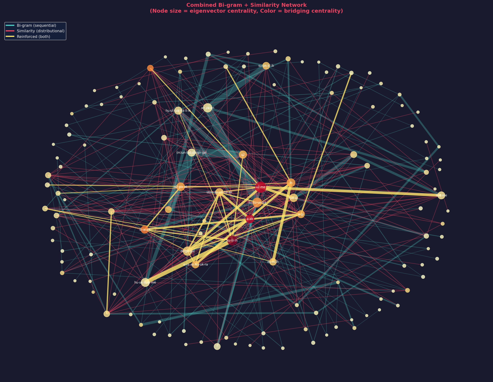
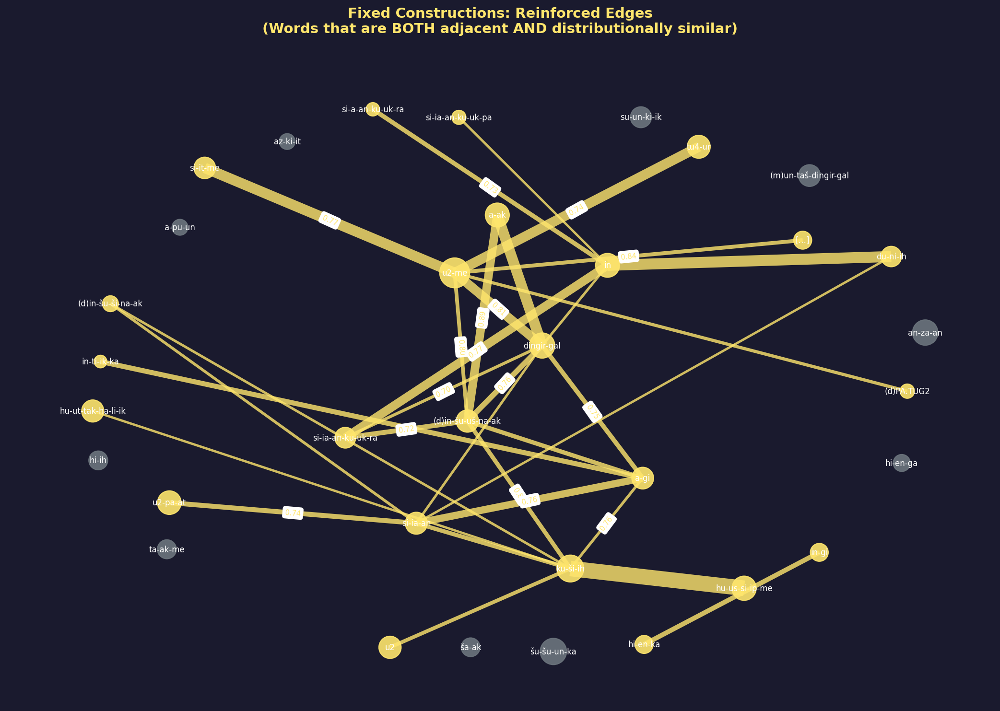
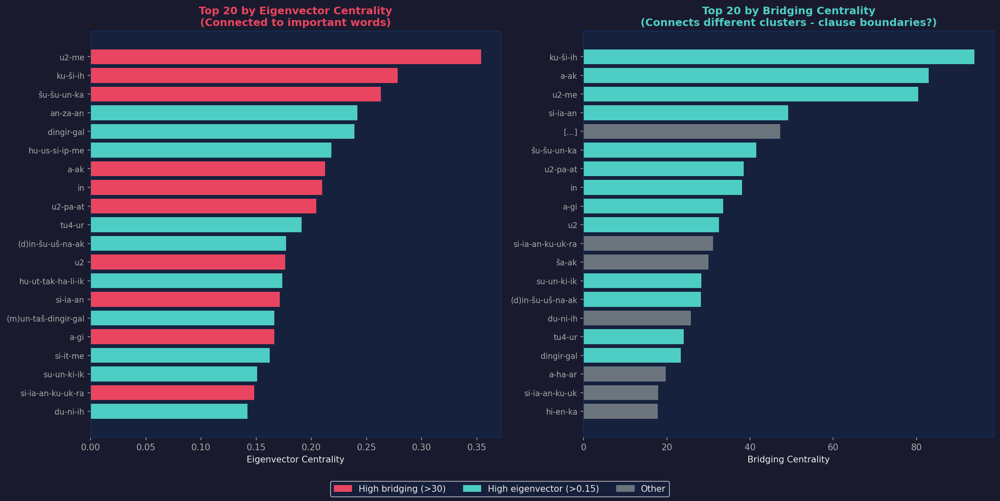
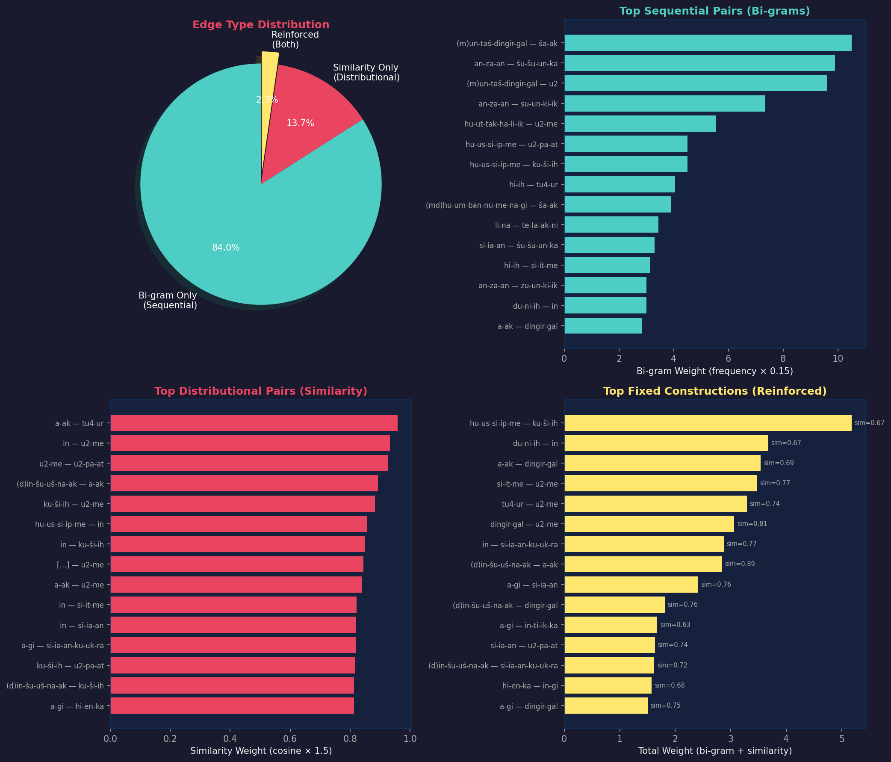
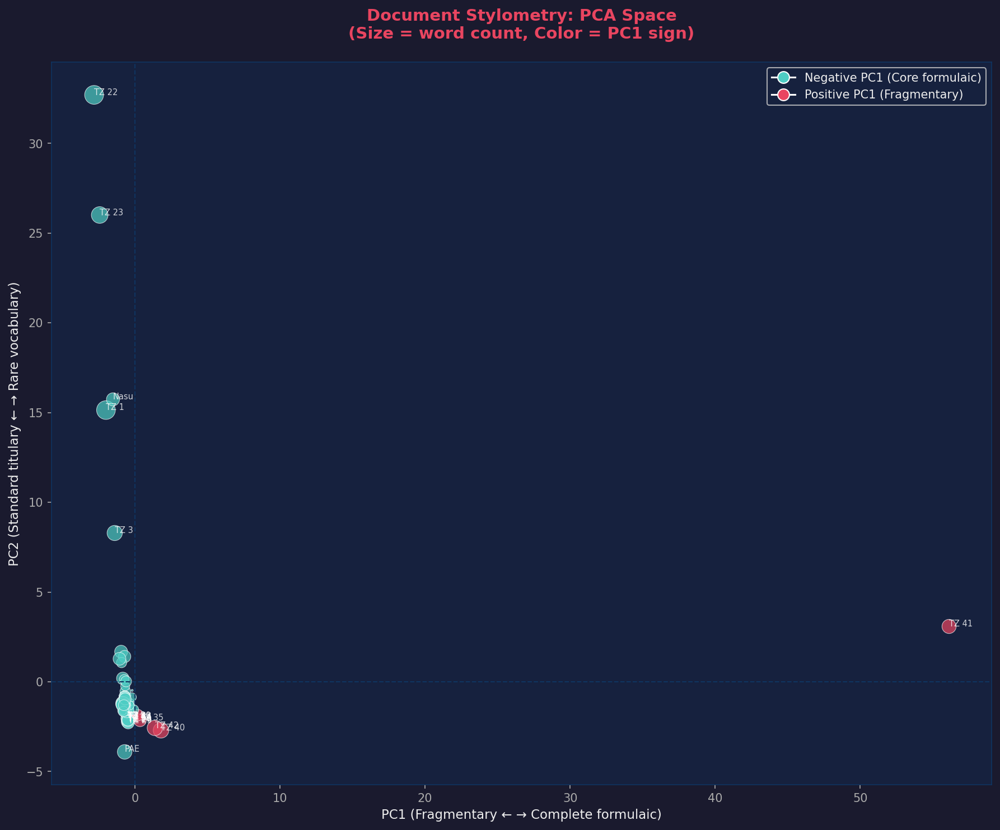

# Elamite Dataset Lab

<div align="center">

**Word2Vec Network Analysis of Ancient Elamite Texts**

*UntN-Nasu Collection | Linguistic Pattern Discovery | Phrase Boundary Detection*

[](https://python.org)
[](#license)

</div>

---

## Overview

This project applies **Word2Vec word embeddings** and **network graph analysis** to a corpus of Elamite texts to explore how words form constructions and identify patterns that may assist with lemmatization and linked data representation.

<div align="center">

| Corpus Statistics | |
|:---:|:---:|
| **85** Documents | **2,582** Tokens |
| **649** Unique Words | **1,397** Combined Edges |

</div>

---

## Bi-gram + Similarity Network Analysis

### Methodology

We combine two types of linguistic relationships:

| Relationship Type | What it captures | Edge Weight |
|:------------------|:-----------------|:------------|
| **Syntagmatic (Bi-gram)** | Words appearing adjacent in text | Low (0.15 per occurrence) |
| **Paradigmatic (Similarity)** | Words with similar distributions | High (cosine × 1.5) |
| **Reinforced (Both)** | Fixed constructions | Combined |

### Combined Network
*Cyan = bi-gram edges, Red = similarity edges, Gold = reinforced (both)*

<div align="center">

</div>

---

### Fixed Constructions (Reinforced Edges)
*32 word pairs that are BOTH adjacent AND distributionally similar*

<div align="center">

</div>

---

### Centrality Analysis
*Eigenvector = connected to important words | Bridging = connects different clusters*

<div align="center">

</div>

---

### Edge Type Analysis
*Distribution of syntagmatic vs paradigmatic relationships*

<div align="center">

</div>

---

### Document Stylometry (PCA)
*Documents positioned by vocabulary usage patterns*

<div align="center">

</div>

---

## Key Findings

### 1. Fixed Constructions Identified

| Word Pair | Similarity | Interpretation |
|:----------|:----------:|:---------------|
| `(d)in-šu-uš-na-ak — a-ak` | 0.89 | Divine name + connective |
| `dingir-gal — u2-me` | 0.81 | "Great god" + verbal marker |
| `ku-ši-ih — (d)in-šu-uš-na-ak` | 0.81 | Grammatical + divine name |
| `si-it-me — u2-me` | 0.77 | Verbal forms clustering |

### 2. Clause Boundary Candidates

| Word | Bridging Score | Hypothesis |
|:-----|:--------------:|:-----------|
| `ku-ši-ih` | 93.9 | Connects different clause types |
| `a-ak` | 83.0 | **Conjunction** — joins clauses |
| `u2-me` | 80.4 | Verbal element |

### 3. Royal Title Formula

```
(m)un-taš-dingir-gal  ša-ak  an-za-an  šu-šu-un-ka  su-un-ki-ik
[Royal name]          [?]    [Anshan]  [of Susa]    [king]
```

This bi-gram chain appears 66+ times — the standard royal titulary.

### 4. The `-me` Suffix Class

Words ending in `-me` form a tight distributional cluster, suggesting a **verbal/participial marker**:
- `u2-me`, `si-it-me`, `ta-ak-me`, `hu-us-si-ip-me`

---

## Original Network Analysis

### Full Word Network
*Node size = connectivity, Color = determinative type*

<div align="center">

</div>

---

### Core Hub Words

<div align="center">

</div>

---

### Word Similarity Heatmap

<div align="center">

</div>

---

### Morphological Distribution

<div align="center">

</div>

---

## Interactive Visualizations

| File | Description |
|:-----|:------------|
| **`visualize_network.html`** | Original similarity network explorer |
| **`visualize_bigram_network.html`** | Bi-gram + similarity network with edge type filtering |

Open in browser to:
- Toggle between edge types (bi-gram, similarity, reinforced)
- Size nodes by eigenvector or bridging centrality
- Search for specific words
- Click nodes to explore connections

---

## Project Structure

```
ElamiteDatasetLab/
│
├── Data & Models
│   ├── texts/                          # 85 document text files
│   ├── UntN-Nasu texts Word-level.csv  # Source data
│   └── elamite_word2vec.model          # Trained Word2Vec model
│
├── Network Analysis (Similarity)
│   ├── edges_similarity.csv            # Similarity edge list
│   ├── nodes_attributes.csv            # Node attributes
│   └── elamite_graph.json              # Full similarity graph
│
├── Network Analysis (Bi-gram + Similarity)
│   ├── bigram_similarity_edges.csv     # Combined edge list
│   ├── nodes_centrality.csv            # Eigenvector & bridging scores
│   ├── document_pca.csv                # Document stylometry
│   └── bigram_similarity_graph.json    # Combined graph
│
├── Visualizations
│   ├── visualize_network.html          # Interactive (similarity)
│   ├── visualize_bigram_network.html   # Interactive (combined)
│   ├── bigram_similarity_network.png   # Combined network
│   ├── reinforced_constructions.png    # Fixed constructions
│   ├── centrality_comparison.png       # Eigenvector vs bridging
│   ├── edge_type_analysis.png          # Edge distribution
│   ├── document_pca_space.png          # Stylometry
│   ├── network_overview.png            # Full network
│   ├── network_hub_subgraph.png        # Hub words
│   ├── similarity_heatmap.png          # Similarity matrix
│   └── morphological_distribution.png  # Suffix stats
│
├── Scripts
│   ├── generate_txt_files.py           # CSV → text files
│   ├── run_word2vec.py                 # Train Word2Vec
│   ├── analyze_embeddings.py           # Clustering analysis
│   ├── build_network_graph.py          # Similarity network
│   ├── bigram_similarity_network.py    # Combined network
│   ├── create_visualizations.py        # Similarity visualizations
│   └── create_bigram_visualizations.py # Combined visualizations
│
├── Reports
│   ├── LINGUISTIC_CONCLUSIONS.md       # Deep analysis findings
│   ├── bigram_similarity_report.txt    # Combined network report
│   ├── network_analysis_report.txt     # Similarity network report
│   └── Elamite_Word2Vec_Report.md      # Methodology report
│
└── Linked Data
    └── elamite_triples.nt              # RDF N-Triples
```

---

## Usage

```bash
# 1. Generate text files from CSV
python3 generate_txt_files.py

# 2. Train Word2Vec model
python3 run_word2vec.py

# 3. Run embedding analysis
python3 analyze_embeddings.py

# 4. Build similarity network
python3 build_network_graph.py

# 5. Build bi-gram + similarity network
python3 bigram_similarity_network.py

# 6. Generate all visualizations
python3 create_visualizations.py
python3 create_bigram_visualizations.py
```

**Requirements:**
```bash
pip install gensim scikit-learn numpy matplotlib networkx
```

---

## Linked Data Export

Ready for knowledge graph representation:

- **`bigram_similarity_edges.csv`** — Import into Gephi with edge type column
- **`elamite_triples.nt`** — RDF N-Triples format
- **`nodes_centrality.csv`** — Node attributes for SPARQL

---

## Team

**Parsa Faraji** & **Adam Anderson**

---

## License

For academic use.
