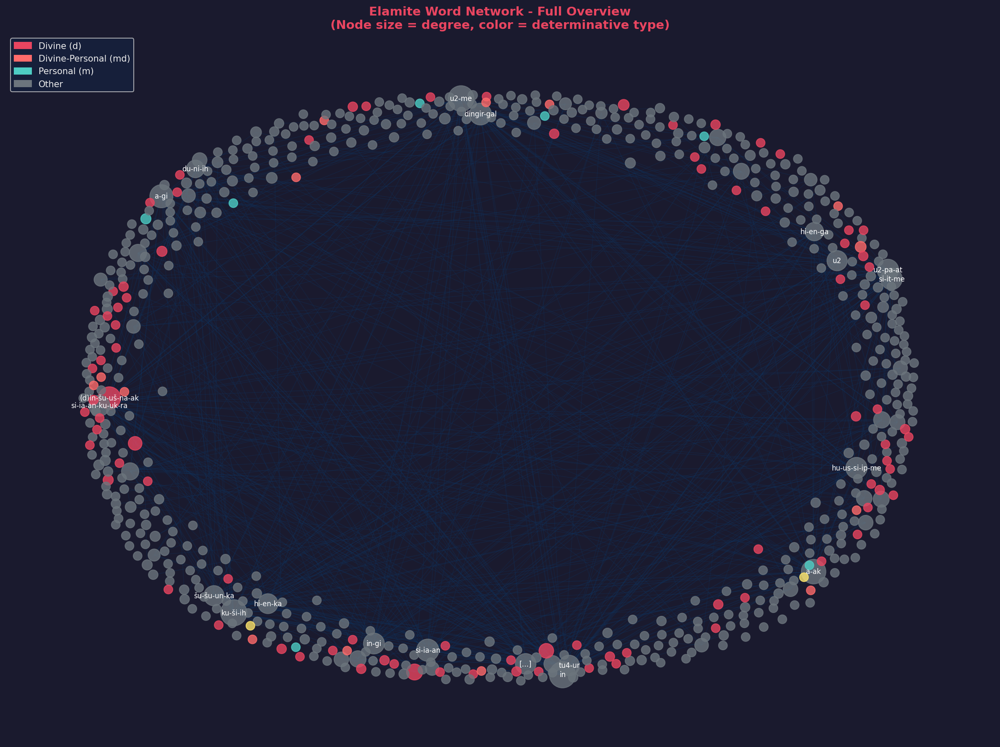
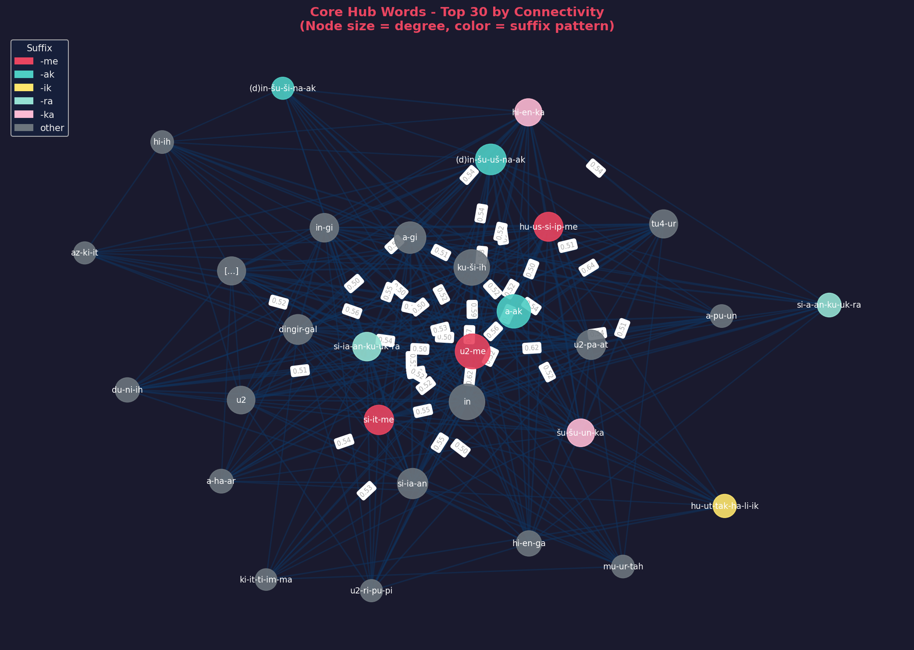
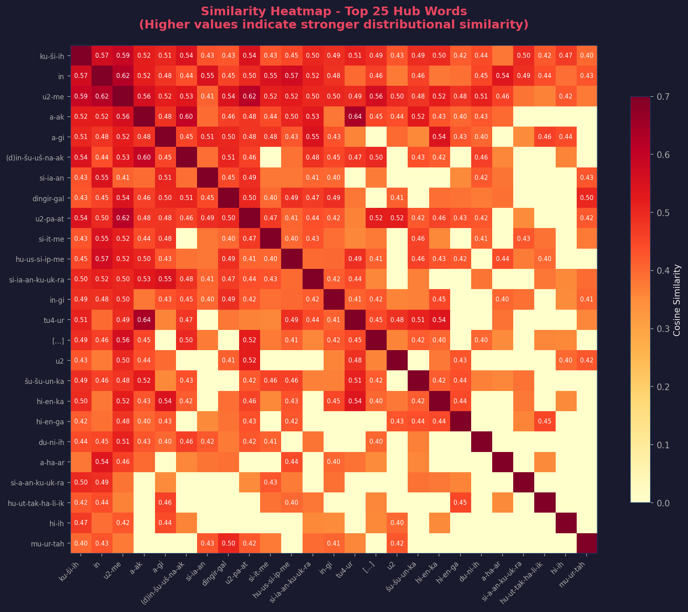
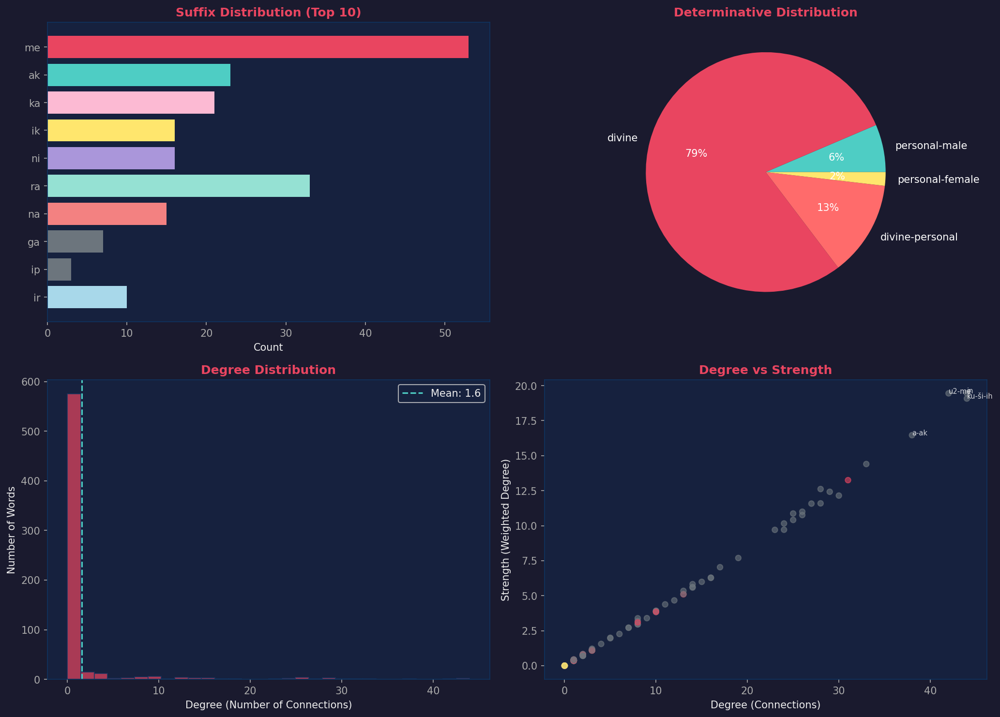
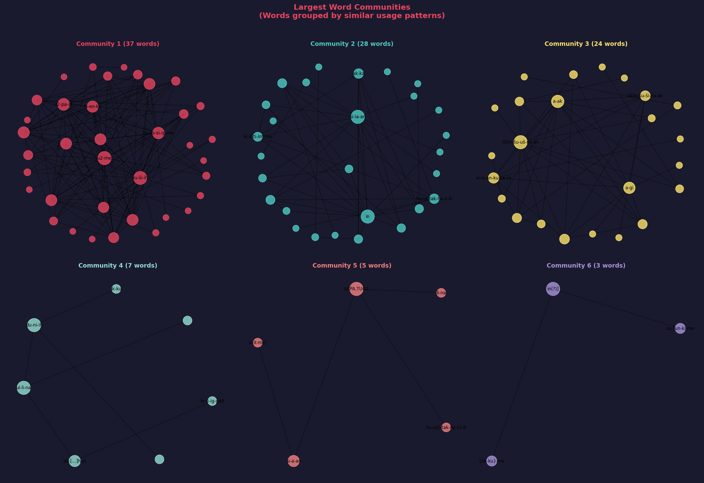

# Elamite Dataset Lab

<div align="center">

**Word2Vec Network Analysis of Ancient Elamite Texts**

*UntN-Nasu Collection | Linguistic Pattern Discovery*

[](https://python.org)
[](#license)

</div>

---

## Overview

This project applies **Word2Vec word embeddings** and **network graph analysis** to a corpus of Elamite texts to explore how words form constructions and identify patterns that may assist with lemmatization and linked data representation.

<div align="center">

| Corpus Statistics | |
|:---:|:---:|
| **85** Documents | **2,582** Tokens |
| **649** Unique Words | **514** Network Edges |

</div>

---

## Network Visualization

### Full Word Network
*Node size = connectivity, Color = determinative type (divine, personal, other)*

<div align="center">

</div>

---

### Core Hub Words
*The 30 most connected words form the grammatical backbone of the corpus*

<div align="center">

</div>

---

### Word Similarity Heatmap
*Cosine similarity between the top 25 hub words*

<div align="center">

</div>

---

### Morphological Distribution
*Suffix patterns and determinative types across the vocabulary*

<div align="center">

</div>

---

### Community Structure
*Words grouped by similar usage patterns*

<div align="center">

</div>

---

## Key Findings

### Hub Words (Grammatical Function Words)
The most connected words likely serve grammatical functions:

| Word | Connections | Hypothesis |
|:-----|:-----------:|:-----------|
| `in` | 44 | Conjunction or particle |
| `ku-ši-ih` | 44 | High-frequency grammatical element |
| `u2-me` | 42 | Verbal auxiliary (-me suffix) |
| `a-ak` | 38 | Connective (-ak suffix) |
| `a-gi` | 33 | Related grammatical function |

### Morphological Patterns
Suffix patterns show distributional coherence:

| Suffix | Count | Possible Function |
|:------:|:-----:|:------------------|
| `-me` | 53 | Verbal/participial marker |
| `-ra` | 33 | Locative or directional |
| `-ak` | 23 | Genitive or connective |
| `-ka` | 21 | Locative variant |

### Highest Similarity Pairs
Word pairs with strongest distributional similarity:

```
a-ak          <->  tu4-ur              : 0.638
u2-me         <->  in                  : 0.622
u2-pa-at      <->  u2-me               : 0.618
(d)in-šu-uš-na-ak  <->  a-ak           : 0.595
```

---

## Interactive Visualization

Open **`visualize_network.html`** in a browser for an interactive exploration:
- Adjust similarity threshold in real-time
- Color nodes by determinative, suffix, or community
- Search for specific words
- Click nodes to explore their connections

---

## Project Structure

```
ElamiteDatasetLab/
│
├── Data & Models
│   ├── texts/                          # 85 document text files
│   ├── UntN-Nasu texts Word-level.csv  # Source data
│   ├── elamite_word2vec.model          # Trained Word2Vec model
│   └── word_similarities.csv           # Word similarity scores
│
├── Network Analysis
│   ├── edges_similarity.csv            # Edge list for Gephi
│   ├── nodes_attributes.csv            # Node attributes
│   ├── elamite_graph.json              # Full graph (JSON)
│   ├── elamite_triples.nt              # RDF triples for linked data
│   └── network_analysis_report.txt     # Detailed analysis
│
├── Visualizations
│   ├── visualize_network.html          # Interactive D3.js visualization
│   ├── network_overview.png            # Full network graph
│   ├── network_hub_subgraph.png        # Core hub words
│   ├── similarity_heatmap.png          # Similarity matrix
│   ├── morphological_distribution.png  # Suffix/determinative charts
│   └── community_structure.png         # Word communities
│
├── Scripts
│   ├── generate_txt_files.py           # CSV → text files
│   ├── run_word2vec.py                 # Train Word2Vec model
│   ├── analyze_embeddings.py           # Clustering analysis
│   ├── build_network_graph.py          # Network graph builder
│   └── create_visualizations.py        # Generate PNG figures
│
└── Reports
    ├── Elamite_Word2Vec_Report.md      # Full methodology report
    └── embedding_insights.txt          # Pattern analysis
```

---

## Usage

```bash
# 1. Generate text files from CSV
python3 generate_txt_files.py

# 2. Train Word2Vec model
python3 run_word2vec.py

# 3. Run embedding analysis
python3 analyze_embeddings.py

# 4. Build network graph and export data
python3 build_network_graph.py

# 5. Generate visualizations
python3 create_visualizations.py
```

**Requirements:**
```bash
pip install gensim scikit-learn numpy matplotlib networkx
```

---

## Linked Data Export

The project exports data ready for linked data representation:

- **`edges_similarity.csv`** — Import into Gephi for network exploration
- **`elamite_triples.nt`** — RDF N-Triples format with similarity predicates
- **`elamite_graph.json`** — JSON format for web applications

Example RDF triple:
```turtle
<http://elamite.example.org/word/a-ak>
    <http://elamite.example.org/ontology/similarTo>
    <http://elamite.example.org/word/tu4-ur> .
```

---

## Team

**Parsa Faraji** & **Adam Anderson**

---

## License

For academic use.
